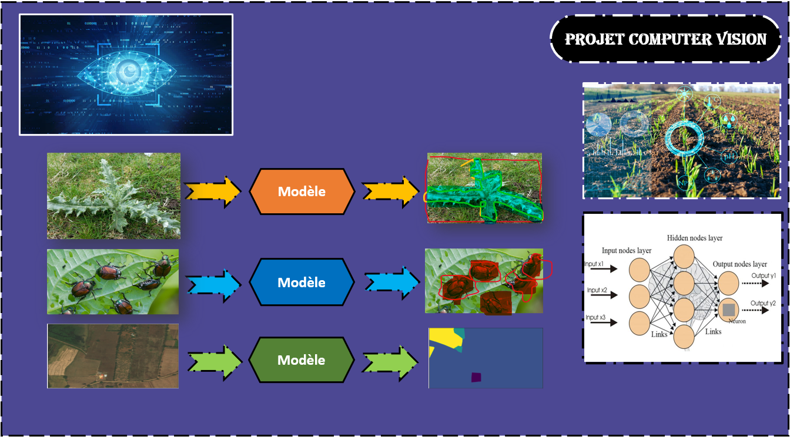

<ul >
    <li>ELGHAZI Soufiane</li>
</ul>

 

<h1 style='color:#4c4893' align='center'>
    Projet Computer Vision : Gestion des Risques Agricoles
</h1>
<h2 style='color:purple' align='center'>
Gestion des Risques Agricoles
</h2>

L'agriculture intelligente est une discipline en pleine croissance qui tire parti des avancées en 
vision par ordinateur pour résoudre des défis complexes dans le domaine agricole. Notre projet vise à exploiter les technologies de pointe de la vision par ordinateur pour adresser spécifiquement les défis lié au :

• La détection et le diagnostic des maladies des plantes,  
• Harmful-Insects-Classification&ObjectDetection  
• Land-Cover-Segmentation  
• Harmful-Insects-Classification&ObjectDetection  

 

Dans ce Répértoir vous allez trouver les éléments suivants:
<ul>
    <li>Harmful-Insects-Classification&ObjectDetection.ipynb</li>
    <li>Land-Cover-Segmentation.ipynb</li>
    <li>Harmful-Insects-Classification&ObjectDetection.ipynb</li>
    <li>Advanced-CNN-Apples-Classification.ipynb</li>  
</ul>

 

    

 

 ✨ THE END ✨
 